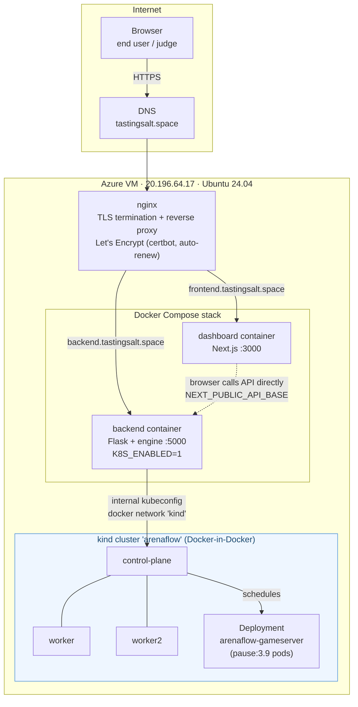
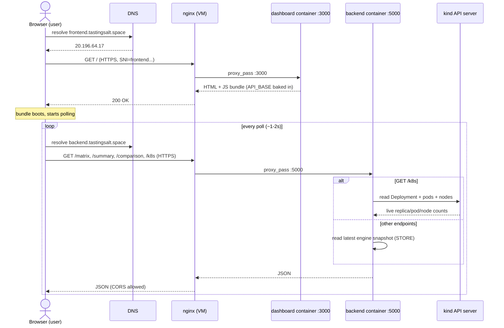
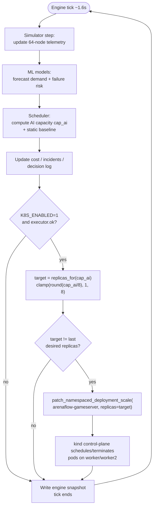
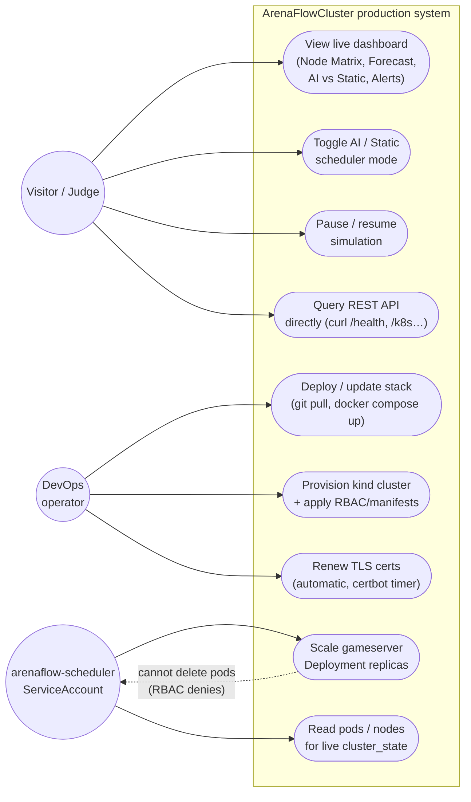

# Production Deployment — how ArenaFlowCluster runs in the wild

This documents the **live deployment** of ArenaFlowCluster at
[frontend.tastingsalt.space](https://frontend.tastingsalt.space) /
[backend.tastingsalt.space](https://backend.tastingsalt.space), separate from the
local dev / `docker compose up` instructions in the [README](README.md). It
covers the actual VM, the reverse proxy, TLS, the container stack, and the real
`kind` Kubernetes cluster the AI scheduler drives in production.

---

## 1. Architecture overview

One Azure VM hosts everything: nginx terminates TLS and fans out to two Docker
containers (dashboard, backend); the backend additionally drives a real 3-node
Kubernetes cluster running inside the same VM.



Key facts:

| Layer | Detail |
|---|---|
| DNS | `frontend.tastingsalt.space` and `backend.tastingsalt.space` → `20.196.64.17` (A records) |
| Firewall | Azure NSG allows inbound 22 / 80 / 443 |
| Reverse proxy | nginx, one server block per subdomain, HTTP→HTTPS redirect |
| TLS | Let's Encrypt via `certbot --nginx`, renews automatically via systemd timer |
| App runtime | Docker Compose — `backend` (Flask, port 5000) + `dashboard` (Next.js, port 3000) |
| Orchestration | `kind` (Kubernetes-in-Docker) cluster `arenaflow`: 1 control-plane + 2 workers |
| AI ↔ K8s bridge | Backend container attached to the `kind` Docker network, mounts an **internal** kubeconfig (`server: https://arenaflow-control-plane:6443`) |

---

## 2. Why the dashboard talks to the backend directly

The Next.js dashboard is a **static/browser-rendered** build — `NEXT_PUBLIC_API_BASE`
is inlined into the JS bundle at `docker build` time (not read at runtime). In
production this is built as:

```yaml
# docker-compose.override.yml
dashboard:
  build:
    args:
      NEXT_PUBLIC_API_BASE: https://backend.tastingsalt.space
```

So the **browser**, not the dashboard container, makes cross-origin HTTPS calls
straight to `backend.tastingsalt.space`. This is why `flask-cors` is enabled on
the API — the two subdomains are different origins.

---

## 3. Sequence diagram — a page load, end to end



---

## 4. Activity diagram — AI scheduler tick → real cluster reconciliation

This is the loop running continuously inside the backend container, independent
of any dashboard traffic:



The executor is **defensive by design**: if the `kubernetes` client can't be
imported, no cluster is reachable, or a call fails, `ok=False` is set and every
later step becomes a no-op — the pure-simulation demo keeps running either way.

---

## 5. Use case diagram — who does what



`arenaflow-scheduler` is intentionally the *narrowest* actor: its Role grants
only `get/list/watch` on deployments & pods and `get/patch/update` on
`deployments/scale` — verified live with:

```bash
kubectl auth can-i patch deployments --subresource=scale -n arenaflow \
  --as=system:serviceaccount:arenaflow:arenaflow-scheduler   # yes
kubectl auth can-i delete pods -n arenaflow \
  --as=system:serviceaccount:arenaflow:arenaflow-scheduler   # no
```

(Note: the production backend currently runs with the `kind`-generated
**admin** kubeconfig, not impersonating this ServiceAccount — see §7 for the
in-cluster alternative that would use it directly.)

---

## 6. What lives where on the VM

```
/home/azureuser/
├── ArenaFlowCluster/              # git clone of origin/main
│   ├── docker-compose.yml         # committed: backend + dashboard services
│   ├── docker-compose.override.yml# NOT committed: prod-only overrides (see below)
│   ├── Dockerfile.backend
│   ├── dashboard/Dockerfile
│   └── k8s/                      # namespace.yaml, rbac.yaml, gameserver-deployment.yaml, kind-cluster.yaml
├── kind-internal-kubeconfig       # kind get kubeconfig --internal (server=arenaflow-control-plane:6443)
└── .kube/config                   # kind get kubeconfig (admin, host-facing, for kubectl on the VM itself)

/etc/nginx/sites-available/
├── frontend.tastingsalt.space     # :3000, certbot-managed TLS block appended
└── backend.tastingsalt.space      # :5000, certbot-managed TLS block appended

/etc/letsencrypt/live/
└── frontend.tastingsalt.space/    # fullchain.pem + privkey.pem (covers both SANs)
```

`docker-compose.override.yml` (prod-only, layered automatically by
`docker compose up`) is what makes this deployment different from a laptop
`docker compose up --build`:

```yaml
networks:
  kind:
    external: true
    name: kind             # kind's own Docker network — lets the backend

services:                  # container reach the control-plane by container name
  backend:
    restart: unless-stopped
    environment:
      - K8S_ENABLED=1
    volumes:
      - /home/azureuser/kind-internal-kubeconfig:/root/.kube/config:ro
    networks: [default, kind]

  dashboard:
    build:
      args:
        NEXT_PUBLIC_API_BASE: https://backend.tastingsalt.space
    restart: unless-stopped
```

---

## 7. Two ways to run the K8s executor (which one is live)

`backend/app/services/k8s_executor.py` supports either mode; **this deployment
uses the first one**:

1. **Host-kubeconfig mode (live now)** — the backend container runs
   alongside the cluster (attached to the `kind` network), loads a kubeconfig
   mounted from the host, and calls the API from outside the cluster. Simple,
   and matches `k8s/setup.sh`'s "default demo" comment.
2. **In-cluster mode (`k8s/backend-deployment.yaml`, not deployed here)** — the
   backend itself runs as a pod inside `arenaflow`, using
   `serviceAccountName: arenaflow-scheduler` and `load_incluster_config()`, so
   the least-privilege RBAC is enforced on the live traffic path, not just
   provable via `auth can-i`. Left as documented-but-optional since it would
   mean the public backend runs inside the demo cluster it's also scaling.

---

## 8. Verifying it's real (not simulated)

```bash
# from the VM
export KUBECONFIG=~/.kube/config
kubectl -n arenaflow get deploy,pods -w      # watch replica count change live

# from anywhere
curl https://backend.tastingsalt.space/health   # engine status, mode, tick
curl https://backend.tastingsalt.space/k8s      # {"ok":true,"context":"kind-arenaflow","nodes":3,"desired":N,"pods":N,...}
```

Observed during setup: replica count moved `1 → 7 → 6` as simulated demand
cycled — confirmed via `kubectl get pods -n arenaflow` while the AI scheduler
was reconciling, not a hardcoded or mocked value.
